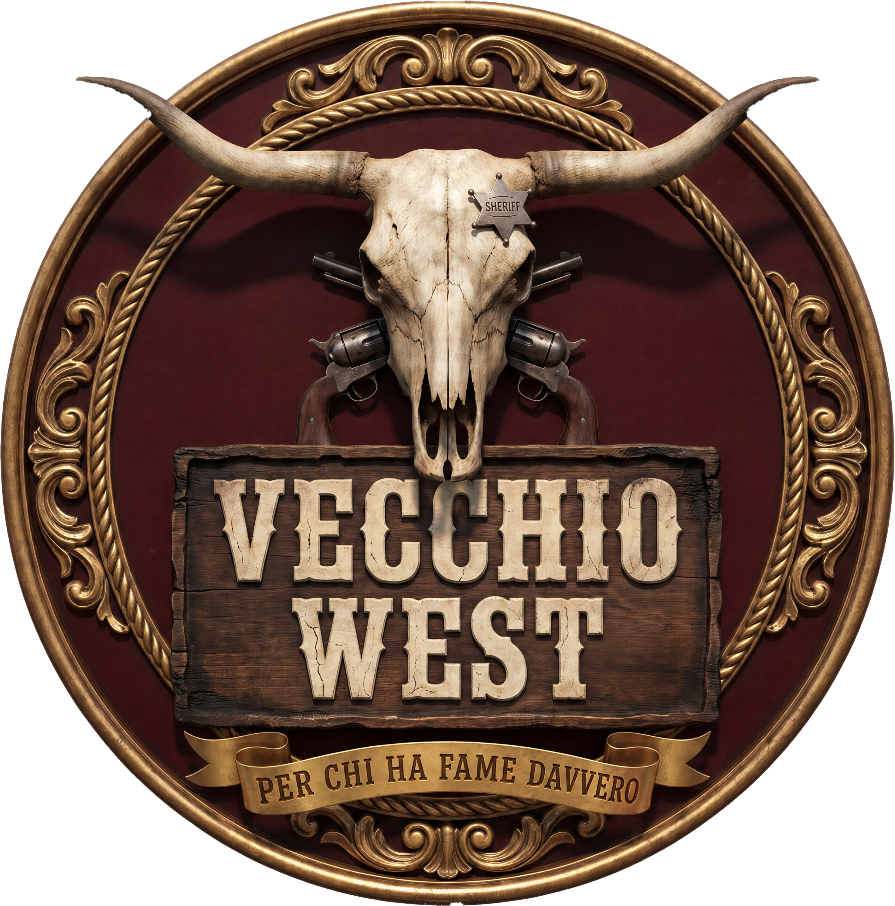

# IMPLEMENTAZIONE · Roadmap modifiche Vecchio West

> Dossier patch del **report di valutazione UX/UI**, pronto per applicazione manuale.
> Ogni modifica è auto-contenuta: path, codice _prima_, codice _dopo_, rationale, verifica.

**Versione**: 1.0 · Stagione 2026
**Cartella progetto**: `/vecchiowestfinal/`
**Approccio consigliato**: applicare nell'ordine elencato (Quick → Medium → Detail). Ogni modifica è indipendente salvo dipendenze esplicitate.

---

## Come usare questo file

1. **Apri** il file/path indicato in cima alla patch.
2. **Cerca** il blocco "PRIMA" usando una stringa caratteristica (es. la prima riga).
3. **Sostituisci** con il blocco "DOPO".
4. **Salva** e verifica nel browser i punti elencati sotto "Verifica".
5. **Commit** con il messaggio suggerito.

Convenzioni:
- 🟢 = Quick Win (≤30 min)
- 🟡 = Medium effort (30–90 min)
- 🔵 = Detail / polish (15–45 min)
- `+++ file:linea` = punto di inserimento
- Le righe marcate `// …` indicano codice esistente non modificato (per orientamento).

---

## Indice

### A · Quick Wins (9)
- [A1 · Microcopy west-tonale globale](#a1)
- [A2 · Chip allergeni come display](#a2)
- [A3 · Avatar iniziali nelle recensioni](#a3)
- [A4 · Scroll affordance (mask fade) sui tab menu](#a4)
- [A5 · Sezione recensioni su fondo paper](#a5)
- [A6 · WhatsApp deep-link prenotazione prefilled](#a6)
- [A7 · aria-live carousel recensioni + focus trap roulette](#a7)
- [A8 · tel: "Chiama subito" su sticky CTA mobile](#a8)
- [A9 · Token semantici palette + verde oliva marchigiano](#a9)

### B · Medium effort (8)
- [B1 · Sistema card a 3 tier (paper / wood / minimal)](#b1)
- [B2 · SVG stars component con stamp animation](#b2)
- [B3 · Swipe touch nativo sul carousel recensioni](#b3)
- [B4 · Filtro allergeni multi-toggle a chip](#b4)
- [B5 · Sidebar mobile slide-in drawer](#b5)
- [B6 · Tactile feedback `:active` mobile sulle card](#b6)
- [B7 · Reveal progressivo allergeni/badge su hover menu](#b7)
- [B8 · Date eventi con label "stasera / domani / tra X giorni"](#b8)

### C · Detail / polish (4)
- [C1 · Skip-to-main-content link (a11y)](#c1)
- [C2 · Cursor mirino sulla galleria (desktop)](#c2)
- [C3 · Print stylesheet menu locandina](#c3)
- [C4 · Magnetic CTA sui pulsanti principali (desktop)](#c4)

### D · Verifica finale
- [Smoke test pagine](#smoke)
- [Lighthouse target](#lh)
- [Cross-device check](#cross)

---

<a id="a1"></a>
## A1 · Microcopy west-tonale globale 🟢

**Why**: La voce del brand è "spaghetti western italiano" ma molti microtesti restano neutri. Sostituire CTA, empty state, loading e messaggi d'errore con un tono coerente da saloon (asciutto, ironico, evocativo) alza la percezione di carattere senza appesantire la UI.

**Files**:
- `data/nav.json`
- `data/contatti.json`
- `data/eventi.json`
- `data/recensioni.json`
- `data/menu.json`
- `data/footer.json`
- `data/sticky.json`
- `js/app.js` (testo loading/error)

**Glossario west-tonale di riferimento**:

| Concetto neutro            | Variante Vecchio West                          |
|----------------------------|-------------------------------------------------|
| Caricamento…               | Sto sellando i cavalli…                         |
| Errore di caricamento      | Polvere sui binocoli — riprova più tardi        |
| Nessun risultato           | Nessuna traccia da queste parti                 |
| Prenota                    | Riserva il posto al saloon                      |
| Chiama                     | Suona il campanaccio                            |
| Iscriviti                  | Sali in sella                                   |
| Scopri di più              | Tira fuori la mappa                             |
| Invia                      | Spara il messaggio                              |
| Conferma                   | Stretta di mano                                 |
| Annulla                    | Lascia stare                                    |
| Vedi tutti                 | Guarda l'intera mandria                         |

### Patch A1.1 — `data/contatti.json`

**PRIMA** (campo `whatsapp_msg_default`):
```json
"whatsapp_msg_default": "Ciao, vorrei prenotare un tavolo al Vecchio West"
```

**DOPO**:
```json
"whatsapp_msg_default": "Salve forestiero, vorrei riservare un tavolo al Vecchio West.\n\nGiorno: \nOrario: \nCoperti: \nNome: "
```

> Il template con righe in attesa di compilazione fa sì che chi tocca il bottone WhatsApp veda subito i campi da riempire. Si combina con la patch [A6](#a6).

### Patch A1.2 — `data/sticky.json`

**PRIMA** (etichette CTA):
```json
"whatsapp_label": "WhatsApp",
"phone_label": "Chiama"
```

**DOPO**:
```json
"whatsapp_label": "Riserva il posto",
"phone_label": "Chiama subito"
```

### Patch A1.3 — `js/app.js` (stato loading)

**PRIMA** (cercare la stringa `Caricamento` o `Loading`):
```js
// nel template di fallback dei blocchi
container.innerHTML = '<p>Caricamento…</p>';
```

**DOPO**:
```js
container.innerHTML = '<p class="vw-loading-msg">Sto sellando i cavalli…</p>';
```

### Patch A1.4 — `js/app.js` (stato errore)

**PRIMA**:
```js
container.innerHTML = `<p class="vw-error">Errore di caricamento.</p>`;
```

**DOPO**:
```js
container.innerHTML = `
  <p class="vw-error">
    🌵 Polvere sui binocoli.<br>
    Non riesco a caricare questo blocco — riprova fra un attimo
    o <a href="tel:+393520029607">suona il campanaccio</a>.
  </p>`;
```

### Patch A1.5 — `data/footer.json` (newsletter)

**PRIMA**:
```json
"newsletter": {
  "titolo": "Iscriviti alla newsletter del Saloon",
  "sottotitolo": "Eventi, promo e il calendario del BBQ. Niente spam, parola di pistolero.",
  "cta": "Iscrivimi"
}
```

**DOPO**:
```json
"newsletter": {
  "titolo": "Sali in sella alla newsletter",
  "sottotitolo": "Eventi, drink rari e il calendario del BBQ. Niente spam, parola di pistolero.",
  "cta": "Saltami in groppa"
}
```

### Patch A1.6 — `data/nav.json` (CTA primaria sidebar)

**PRIMA**:
```json
{ "label": "Prenota", "link": "https://wa.me/393520029607", "primary": true }
```

**DOPO**:
```json
{ "label": "Riserva il posto", "link": "https://wa.me/393520029607?text=Salve%20forestiero%2C%20vorrei%20riservare%20un%20tavolo", "primary": true, "icon": "horseshoe" }
```

### Patch A1.7 — `data/recensioni.json` (empty state)

Aggiungere (se non presente):
```json
"empty_message": "Le diligenze stanno ancora arrivando. Torna fra qualche giorno per leggere le testimonianze.",
"loading_message": "Sto raccogliendo le voci del saloon…"
```

### Patch A1.8 — `data/eventi.json` (empty state)

Aggiungere:
```json
"empty_message": "Il calendario è in pausa-sigaro. Niente eventi in programma — controlla fra qualche giorno.",
"cta_calendario_completo": "Guarda l'intera mandria"
```

**Verifica A1**:
- Apri `index.html` con DevTools → Network → throttle "Slow 3G", controlla che il messaggio di loading west-tonale appaia.
- Spegni il WiFi e ricarica: deve apparire il fallback "Polvere sui binocoli".
- Su mobile, lo sticky CTA mostra "Riserva il posto" e "Chiama subito".
- Apri WhatsApp dal bottone: il messaggio è pre-compilato con il template multilinea.

**Commit**: `feat(copy): tono west-tonale su CTA, empty state e loading`

---

<a id="a2"></a>
## A2 · Chip allergeni come display 🟢

**Why**: Attualmente gli allergeni sono renderizzati come stringa joinata (`item.allergeni.join(', ')`) → leggibilità povera, nessuna gerarchia visiva. Convertirli in chip pillole compatte migliora scansione + prepara il terreno per il filtro multi-toggle (patch [B4](#b4)).

**Files**:
- `blocks/03-menu.html`
- `blocks/03-menu-verticale.html`
- `css/global.css` (aggiunta classe chip)

### Patch A2.1 — `blocks/03-menu.html`

**PRIMA** (riga ~64 nella card item, contenuto da localizzare nel template `vw-menu__item`):
```html
<p class="vw-menu__item-aller" x-show="item.allergeni?.length">
  <span class="vw-text-mono">Allergeni:</span>
  <span x-text="item.allergeni.join(', ')"></span>
</p>
```

**DOPO**:
```html
<div class="vw-menu__item-aller" x-show="item.allergeni?.length" role="list" aria-label="Allergeni">
  <span class="vw-text-mono vw-menu__item-aller-label">Allergeni</span>
  <template x-for="a in (item.allergeni || [])" :key="a">
    <span class="vw-chip vw-chip--allergen" role="listitem" x-text="a"></span>
  </template>
</div>
```

### Patch A2.2 — `blocks/03-menu-verticale.html`

**PRIMA** (riga 67-70):
```html
<p class="vw-menu-vert__item-aller" x-show="item.allergeni?.length">
  <span class="vw-text-mono">Allergeni:</span>
  <span x-text="item.allergeni.join(', ')"></span>
</p>
```

**DOPO**:
```html
<div class="vw-menu-vert__item-aller" x-show="item.allergeni?.length" role="list" aria-label="Allergeni">
  <span class="vw-text-mono vw-menu-vert__item-aller-label">Allergeni</span>
  <template x-for="a in (item.allergeni || [])" :key="a">
    <span class="vw-chip vw-chip--allergen" role="listitem" x-text="a"></span>
  </template>
</div>
```

### Patch A2.3 — `css/global.css` (aggiungi in fondo, prima dei `@media`)

```css
/* ------- Chip allergeni ------- */
.vw-chip {
  display: inline-flex;
  align-items: center;
  gap: 0.25rem;
  padding: 0.18rem 0.55rem;
  border-radius: 999px;
  font-size: 0.7rem;
  font-family: var(--font-mono);
  font-weight: 500;
  letter-spacing: 0.04em;
  line-height: 1.2;
  white-space: nowrap;
  transition: transform .15s var(--vw-ease-out-back), background .15s ease;
}
.vw-chip--allergen {
  background: rgba(200,155,60,0.10);
  color: var(--vw-gold);
  border: 1px solid rgba(200,155,60,0.30);
  text-transform: lowercase;
}
.vw-chip--allergen:hover { transform: translateY(-1px); }

.vw-menu__item-aller,
.vw-menu-vert__item-aller {
  display: flex;
  flex-wrap: wrap;
  align-items: center;
  gap: 0.35rem;
  margin-top: 0.4rem;
}
.vw-menu__item-aller-label,
.vw-menu-vert__item-aller-label {
  font-size: 0.68rem;
  color: var(--vw-dust);
  text-transform: uppercase;
  letter-spacing: 0.1em;
  margin-right: 0.2rem;
}
```

**Verifica A2**:
- Apri `/menu.html`, sezione "Hamburger": gli allergeni di "Doppio Tex" devono apparire come pillole separate "glutine", "uova", "lattosio" (lowercase).
- Hover su una pillola → lieve `translateY(-1px)`.
- Screen reader: `role="list"` + `aria-label="Allergeni"` legge correttamente.

**Commit**: `refactor(menu): allergeni come chip invece di comma-separated string`

---

<a id="a3"></a>
## A3 · Avatar iniziali nelle recensioni 🟢

**Why**: Le card recensioni mostrano solo nome + testo. Aggiungere un avatar circolare con le iniziali in `--vw-gold` su `--vw-bg-2` aumenta umanizzazione e fiducia, senza richiedere asset (no foto reali da gestire).

**Files**:
- `blocks/07-recensioni.html`
- `js/app.js` (helper `initials()`)

### Patch A3.1 — `js/app.js` (aggiungere helper nel componente `vwRecensioni`)

Nel componente Alpine `vwRecensioni`, dentro l'oggetto restituito (cercare `return { … }`), aggiungere:

**PRIMA**:
```js
return {
  data: {},
  currentIndex: 0,
  // ...altri stati...
  formatStars(n) { /* ... */ },
}
```

**DOPO**:
```js
return {
  data: {},
  currentIndex: 0,
  // ...altri stati...
  formatStars(n) { /* ... */ },
  initials(nome) {
    if (!nome) return '?';
    const parti = String(nome).trim().split(/\s+/);
    const ini = parti.length === 1
      ? parti[0].slice(0, 2)
      : (parti[0][0] + parti[parti.length - 1][0]);
    return ini.toUpperCase();
  },
  avatarHue(nome) {
    // Genera una tonalità stabile per cognome → variazione visiva
    let h = 0;
    for (let i = 0; i < (nome || '').length; i++) h = (h * 31 + nome.charCodeAt(i)) & 0xffff;
    return h % 360;
  },
}
```

### Patch A3.2 — `blocks/07-recensioni.html`

Cercare il template della card recensione (di solito contiene `x-text="r.nome"` e `x-text="r.testo"`).

**PRIMA** (estratto tipico):
```html
<article class="vw-rec__card">
  <header class="vw-rec__head">
    <h4 class="vw-rec__nome" x-text="r.nome"></h4>
    <span class="vw-rec__stars" aria-label="Valutazione" x-text="renderStars(r.stelle)"></span>
  </header>
  <p class="vw-rec__testo" x-text="r.testo"></p>
</article>
```

**DOPO**:
```html
<article class="vw-rec__card">
  <header class="vw-rec__head">
    <div
      class="vw-rec__avatar"
      :style="`--avatar-hue: ${avatarHue(r.nome)}`"
      :aria-label="`Avatar di ${r.nome}`"
    >
      <span x-text="initials(r.nome)"></span>
    </div>
    <div class="vw-rec__meta">
      <h4 class="vw-rec__nome" x-text="r.nome"></h4>
      <span class="vw-rec__stars" :aria-label="`Valutazione ${r.stelle} su 5`" x-text="renderStars(r.stelle)"></span>
    </div>
  </header>
  <p class="vw-rec__testo" x-text="r.testo"></p>
</article>
```

### Patch A3.3 — `blocks/07-recensioni.html` (`<style>` in coda al blocco)

Aggiungere:
```css
.vw-rec__head {
  display: flex;
  align-items: center;
  gap: 0.75rem;
  margin-bottom: 0.6rem;
}
.vw-rec__avatar {
  flex: 0 0 auto;
  width: 44px;
  height: 44px;
  border-radius: 50%;
  display: flex;
  align-items: center;
  justify-content: center;
  font-family: var(--font-display);
  font-weight: 700;
  letter-spacing: 0.02em;
  background: hsl(var(--avatar-hue, 38), 35%, 18%);
  color: var(--vw-gold);
  border: 1.5px solid rgba(200,155,60,0.35);
  box-shadow: inset 0 -2px 4px rgba(0,0,0,0.3);
  user-select: none;
}
.vw-rec__meta { display: flex; flex-direction: column; gap: 0.15rem; }
.vw-rec__meta .vw-rec__nome { margin: 0; }
```

**Verifica A3**:
- Apri `index.html` → sezione recensioni: ogni card ha un cerchio dorato con 1–2 iniziali maiuscole.
- Recensioni con nome "Marco Rossi" → "MR"; "Giulia" → "GI".
- Diverse recensioni hanno tonalità background lievemente diverse (avatarHue).
- Test con `prefers-contrast: more` su DevTools.

**Commit**: `feat(recensioni): avatar a iniziali con tonalità stabile per nome`

---

<a id="a4"></a>
## A4 · Scroll affordance sui tab orizzontali menu 🟢

**Why**: Su mobile/tablet, i tab del menu (`03-menu.html`) scorrono orizzontalmente ma non c'è alcuna indicazione visiva che ci sia altro contenuto fuori viewport. Una mask gradient sui bordi laterali segnala l'overflow.

**Files**:
- `blocks/03-menu.html`
- `css/global.css`

### Patch A4 — `blocks/03-menu.html`

Trovare il wrapper dei tab (es. `<div class="vw-menu__tabs">` o `.vw-menu__nav`). Aggiungere classe `--scrollable`:

**PRIMA**:
```html
<nav class="vw-menu__tabs" role="tablist">
  <template x-for="sezione in data.sezioni" :key="sezione.id">
    <button class="vw-menu__tab" /* ... */></button>
  </template>
</nav>
```

**DOPO**:
```html
<div class="vw-menu__tabs-wrap">
  <nav class="vw-menu__tabs vw-menu__tabs--scrollable" role="tablist" data-scroll-mask>
    <template x-for="sezione in data.sezioni" :key="sezione.id">
      <button class="vw-menu__tab" /* ... */></button>
    </template>
  </nav>
</div>
```

E aggiungere in coda al `<style>` del blocco:
```css
.vw-menu__tabs-wrap {
  position: relative;
}
.vw-menu__tabs--scrollable {
  overflow-x: auto;
  scrollbar-width: none;
  -webkit-overflow-scrolling: touch;
  -webkit-mask-image: linear-gradient(
    to right,
    transparent 0,
    #000 32px,
    #000 calc(100% - 32px),
    transparent 100%
  );
  mask-image: linear-gradient(
    to right,
    transparent 0,
    #000 32px,
    #000 calc(100% - 32px),
    transparent 100%
  );
}
.vw-menu__tabs--scrollable::-webkit-scrollbar { display: none; }
```

**Verifica A4**:
- Apri `/index.html` su viewport stretta (375px). I tab del menu sfumano a destra → c'è altro contenuto.
- Scorri a destra: la sfumatura passa a sinistra.
- Su desktop largo con tutti i tab visibili, la mask non disturba (i tab non superano il viewport).

**Commit**: `style(menu): mask fade sui tab orizzontali per scroll affordance`

---

<a id="a5"></a>
## A5 · Sezione recensioni su fondo paper 🟢

**Why**: Tutte le sezioni del sito hanno fondo `--vw-bg` o `--vw-bg-2` (terra scura). La sezione recensioni su fondo `--vw-paper` crea un **breakthrough visivo** (cambio di temperatura), evocativo dei volantini affissi al saloon. Aumenta la memorabilità della sezione che porta più conversione (testimonianze).

**Files**:
- `blocks/07-recensioni.html`

### Patch A5 — `blocks/07-recensioni.html` (`<style>`)

**PRIMA** (riga ~66):
```css
.vw-rec {
  background: var(--vw-bg-2);
  /* ... */
}
```

**DOPO**:
```css
.vw-rec {
  background:
    radial-gradient(circle at 20% 0%, rgba(200,155,60,0.08), transparent 60%),
    radial-gradient(circle at 80% 100%, rgba(200,155,60,0.06), transparent 50%),
    var(--vw-paper);
  color: var(--vw-bg);
  position: relative;
}
.vw-rec::before,
.vw-rec::after {
  content: '';
  position: absolute;
  left: 0; right: 0;
  height: 24px;
  background-image: url("data:image/svg+xml,%3Csvg xmlns='http://www.w3.org/2000/svg' viewBox='0 0 100 24' preserveAspectRatio='none'%3E%3Cpath d='M0,0 L100,0 L100,12 L90,18 L80,10 L70,20 L60,8 L50,16 L40,6 L30,18 L20,10 L10,20 L0,12 Z' fill='%231a120b'/%3E%3C/svg%3E");
  background-size: 100px 24px;
  background-repeat: repeat-x;
  pointer-events: none;
}
.vw-rec::before { top: -1px; }
.vw-rec::after  { bottom: -1px; transform: scaleY(-1); }

/* Card su sfondo paper: usa colori "scuri" */
.vw-rec .vw-rec__card {
  background: rgba(255,255,255,0.55);
  color: var(--vw-bg);
  border: 1px solid rgba(26,18,11,0.12);
  box-shadow: 0 4px 12px rgba(26,18,11,0.08);
}
.vw-rec .vw-rec__nome { color: var(--vw-bg); }
.vw-rec .vw-rec__testo { color: rgba(26,18,11,0.85); }
.vw-rec .vw-rec__stars { color: var(--vw-gold-dark, #a67e1f); }
.vw-rec .vw-rec__dot { background: rgba(26,18,11,0.25); }
.vw-rec .vw-rec__dot.is-active { background: var(--vw-bg); }
```

**Verifica A5**:
- Sezione recensioni ha fondo paper-cream, contrasto alto col resto.
- Bordi superiore/inferiore hanno una sagoma a "frastagliato" che richiama un manifesto strappato.
- Card sembrano "appiccicate" sul foglio (ombra delicata).
- Su `prefers-reduced-motion` nessuna animazione regredisce: l'effetto è statico.

**Commit**: `style(recensioni): breakthrough visivo con fondo paper e bordi frastagliati`

---

<a id="a6"></a>
## A6 · WhatsApp deep-link prenotazione prefilled 🟢

**Why**: Tutti i CTA WhatsApp portano a `wa.me/393520029607` senza prefill. Aggiungere `?text=` con un template multiriga riempie il messaggio per l'utente, riducendo l'attrito e migliorando i dati che il locale riceve.

**Files**:
- `data/contatti.json` (già toccato in [A1.1](#a1))
- `data/sticky.json`
- `data/nav.json` (già toccato in [A1.6](#a1))
- `blocks/08-contatti.html`
- `blocks/09-sticky-cta.html`
- `blocks/03-menu-verticale.html`

### Patch A6.1 — `data/sticky.json` (aggiungere campo)

```json
{
  "whatsapp_url": "https://wa.me/393520029607?text=Salve%20forestiero%2C%20vorrei%20riservare%20un%20tavolo.%0A%0AGiorno%3A%20%0AOrario%3A%20%0ACoperti%3A%20%0ANome%3A%20",
  "phone_url": "tel:+393520029607",
  "whatsapp_label": "Riserva il posto",
  "phone_label": "Chiama subito"
}
```

> `%0A` = newline URL-encoded (compatibile con WhatsApp).

### Patch A6.2 — `blocks/09-sticky-cta.html`

Cercare l'anchor WhatsApp e sostituire l'href hardcoded con il binding dinamico:

**PRIMA**:
```html
<a href="https://wa.me/393520029607" class="vw-sticky__btn vw-sticky__btn--wa">
  WhatsApp
</a>
```

**DOPO**:
```html
<a :href="data.whatsapp_url || 'https://wa.me/393520029607'"
   class="vw-sticky__btn vw-sticky__btn--wa"
   data-cta="sticky-whatsapp">
  <span class="vw-sticky__btn-icon" aria-hidden="true">💬</span>
  <span x-text="data.whatsapp_label || 'Riserva il posto'"></span>
</a>
```

### Patch A6.3 — `blocks/03-menu-verticale.html` (riga 87)

**PRIMA**:
```html
<a href="https://wa.me/393520029607" class="vw-btn vw-btn--gold" data-gunshot>
  Prenota su WhatsApp
</a>
```

**DOPO**:
```html
<a
  href="https://wa.me/393520029607?text=Salve%20forestiero%2C%20vorrei%20riservare%20un%20tavolo.%0A%0AGiorno%3A%20%0AOrario%3A%20%0ACoperti%3A%20%0ANome%3A%20"
  class="vw-btn vw-btn--gold"
  data-gunshot
  data-cta="menu-vert-whatsapp"
  rel="noopener"
  target="_blank">
  Riserva il posto su WhatsApp
</a>
```

### Patch A6.4 — `blocks/08-contatti.html`

Cercare l'anchor WhatsApp principale e applicare lo stesso pattern: il prefill è già in `data.whatsapp_msg_default` (dopo patch [A1.1](#a1)), quindi il binding è:

```html
<a
  :href="`https://wa.me/${(data.whatsapp || '').replace(/\D/g,'')}?text=${encodeURIComponent(data.whatsapp_msg_default || '')}`"
  class="vw-btn vw-btn--gold"
  data-cta="contatti-whatsapp"
  target="_blank"
  rel="noopener">
  💬 Riserva il posto
</a>
```

**Verifica A6**:
- Cliccare i CTA WhatsApp da: sticky mobile, menu page, sezione contatti, sidebar.
- Verifica che WhatsApp si apra con il messaggio prefilled multilinea.
- Mobile: link diretto all'app. Desktop: WhatsApp Web/desktop.

**Commit**: `feat(cta): WhatsApp deep-link prenotazione con template prefilled`

---

<a id="a7"></a>
## A7 · aria-live carousel recensioni + focus trap roulette 🟢

**Why**: Due gap accessibilità: (1) il carousel recensioni cambia slide senza annunciarlo agli screen reader; (2) il modal roulette ha `role="dialog"` ma non intrappola il focus, l'utente da tastiera può "uscire" dal modal aperto. Fix entrambi.

**Files**:
- `blocks/07-recensioni.html`
- `blocks/11-roulette.html`
- `js/app.js`

### Patch A7.1 — `blocks/07-recensioni.html` (aria-live)

Cercare il container della slide attiva (es. `<div class="vw-rec__slide">` o `<article x-show="i === currentIndex">`).

**PRIMA**:
```html
<div class="vw-rec__slide" x-show="i === currentIndex">
  <article class="vw-rec__card">…</article>
</div>
```

**DOPO** — aggiungere `aria-live="polite"` e `aria-atomic="true"` sul wrapper:
```html
<div
  class="vw-rec__slides"
  aria-live="polite"
  aria-atomic="true"
  :aria-busy="spinning ? 'true' : 'false'"
>
  <template x-for="(r, i) in data.recensioni" :key="i">
    <div class="vw-rec__slide" x-show="i === currentIndex" :aria-hidden="i !== currentIndex">
      <article class="vw-rec__card">…</article>
    </div>
  </template>
</div>
```

> `aria-hidden` sulle slide non visibili evita che lo screen reader le legga in batch.

### Patch A7.2 — `blocks/11-roulette.html` (focus trap)

Sul modal (riga ~22–32) aggiungere binding `@keydown.tab.prevent`:

**PRIMA**:
```html
<div
  class="vw-roulette-overlay"
  x-show="overlayOpen"
  x-cloak
  x-transition.opacity.duration.300ms
  @keydown.escape.window="chiudi()"
  role="dialog"
  aria-modal="true"
>
```

**DOPO**:
```html
<div
  class="vw-roulette-overlay"
  x-show="overlayOpen"
  x-cloak
  x-transition.opacity.duration.300ms
  @keydown.escape.window="chiudi()"
  @keydown.tab="trapFocus($event)"
  x-trap.inert.noscroll="overlayOpen"
  role="dialog"
  aria-modal="true"
>
```

> `x-trap` richiede il plugin **@alpinejs/focus**. Se non già caricato, aggiungere in `index.html` prima di `app.js`:
> ```html
> <script defer src="https://cdn.jsdelivr.net/npm/@alpinejs/focus@3.x.x/dist/cdn.min.js"></script>
> ```

In alternativa (senza plugin), implementare manualmente in `js/app.js` dentro `vwRoulette()`:

```js
trapFocus(e) {
  const modal = e.currentTarget.closest('.vw-roulette-modal');
  if (!modal) return;
  const focusable = modal.querySelectorAll(
    'button:not([disabled]), [href], input, select, textarea, [tabindex]:not([tabindex="-1"])'
  );
  if (!focusable.length) return;
  const first = focusable[0];
  const last = focusable[focusable.length - 1];
  if (e.shiftKey && document.activeElement === first) {
    e.preventDefault();
    last.focus();
  } else if (!e.shiftKey && document.activeElement === last) {
    e.preventDefault();
    first.focus();
  }
},
```

E nella `apri()`:
```js
apri() {
  this.overlayOpen = true;
  this.$nextTick(() => {
    const firstBtn = document.querySelector('.vw-roulette-modal .vw-btn');
    if (firstBtn) firstBtn.focus();
  });
},
```

**Verifica A7**:
- Screen reader (VoiceOver/NVDA) su sezione recensioni: al cambio slide annuncia il nuovo nome + testo.
- Apri roulette da tastiera, premi TAB ripetutamente: il focus circola tra "Spara il colpo" → "Lascia stare" → ×close → torna a "Spara il colpo".
- ESC chiude il modal e ritorna il focus al trigger.

**Commit**: `a11y(carousel,modal): aria-live recensioni e focus trap roulette`

---

<a id="a8"></a>
## A8 · tel: "Chiama subito" su sticky CTA mobile 🟢

**Why**: La sticky CTA bottom-bar è il primo punto di contatto sotto i 768px. Il bottone `tel:` deve avere semantica chiara e iconografia diversa da WhatsApp.

**Files**:
- `blocks/09-sticky-cta.html`
- `data/sticky.json` (già toccato in [A6.1](#a6))

### Patch A8 — `blocks/09-sticky-cta.html`

Localizzare il bottone phone e ristrutturarlo:

**PRIMA**:
```html
<a href="tel:+393520029607" class="vw-sticky__btn">Chiama</a>
```

**DOPO**:
```html
<a
  :href="data.phone_url || 'tel:+393520029607'"
  class="vw-sticky__btn vw-sticky__btn--phone"
  data-cta="sticky-phone"
  @click="trackEvent && trackEvent('phone_call_sticky')">
  <span class="vw-sticky__btn-icon" aria-hidden="true">📞</span>
  <span class="vw-sticky__btn-label" x-text="data.phone_label || 'Chiama subito'"></span>
</a>
```

E nello `<style>` (in coda al blocco):
```css
@media (max-width: 767.98px) {
  .vw-sticky__btn--phone .vw-sticky__btn-icon { animation: vw-phone-pulse 2.4s ease-in-out infinite; }
  @keyframes vw-phone-pulse {
    0%, 100% { transform: rotate(0); }
    8%       { transform: rotate(-12deg); }
    16%      { transform: rotate(12deg); }
    24%      { transform: rotate(-8deg); }
    32%      { transform: rotate(0); }
  }
  @media (prefers-reduced-motion: reduce) {
    .vw-sticky__btn--phone .vw-sticky__btn-icon { animation: none; }
  }
}
```

**Verifica A8**:
- Apri su mobile reale (o DevTools mobile emulator, viewport < 768px).
- La sticky bar in basso mostra "💬 Riserva il posto | 📞 Chiama subito".
- L'icona telefono ha una micro-shake ogni 2.4s (subliminale).
- Tocca → si apre la chiamata diretta.
- `prefers-reduced-motion: reduce` → l'animazione si disattiva.

**Commit**: `feat(sticky-cta): tel: con label "Chiama subito" e micro-shake icona`

---

<a id="a9"></a>
## A9 · Token semantici palette + verde oliva marchigiano 🟢

**Why**: Attualmente i token sono solo "raw" (paper, gold, bg). Aggiungere un layer **semantico** (action, state-success, state-error, divider) disaccoppia uso da valore. In parallelo aggiungere `#6b8a4a` (verde oliva marchigiano) come accento per badge "veg", "marchigiano DOP", stato "disponibile".

**Files**:
- `css/tokens.css`

### Patch A9 — `css/tokens.css`

Aggiungere alla fine del file (o in fondo al `:root`), prima della chiusura `}`:

```css
  /* ============================================================
   *  PALETTE — Estensione marchigiana
   * ============================================================ */
  --vw-olive: #6b8a4a;          /* verde oliva, scottona marchigiana */
  --vw-olive-soft: #a4b889;
  --vw-olive-dark: #4d6633;

  --vw-gold-dark: #a67e1f;       /* contrast safe su paper */
  --vw-rust: #c45a3a;            /* errori, alert dolce */
  --vw-rust-soft: #e8a292;

  /* ============================================================
   *  TOKEN SEMANTICI — non riferirsi mai al colore raw nel CSS
   *  delle componenti, usare questi.
   * ============================================================ */

  /* Action / interazione */
  --vw-action-primary:        var(--vw-gold);
  --vw-action-primary-hover:  #d9ad53;
  --vw-action-primary-press:  var(--vw-gold-dark);
  --vw-action-secondary:      var(--vw-paper);
  --vw-action-on-action:      var(--vw-bg);  /* testo su action-primary */

  /* Stato */
  --vw-state-success:   var(--vw-olive);
  --vw-state-warning:   #d6a73a;
  --vw-state-error:     var(--vw-rust);
  --vw-state-info:      var(--vw-latin-magenta, #b53a7a);

  /* Divider / surface */
  --vw-divider:           rgba(200, 155, 60, 0.18);
  --vw-divider-strong:    rgba(200, 155, 60, 0.35);
  --vw-divider-on-paper:  rgba(26, 18, 11, 0.18);
  --vw-surface-elevated:  rgba(255, 255, 255, 0.04);
  --vw-surface-overlay:   rgba(15, 10, 6, 0.88);

  /* Text on paper */
  --vw-text-on-paper:        var(--vw-bg);
  --vw-text-on-paper-muted:  rgba(26, 18, 11, 0.65);
  --vw-text-on-paper-faint:  rgba(26, 18, 11, 0.40);

  /* Focus ring (a11y) */
  --vw-focus-ring: 0 0 0 3px rgba(200, 155, 60, 0.55);
}

/* Utility: focus-visible globale */
*:focus-visible {
  outline: none;
  box-shadow: var(--vw-focus-ring);
  border-radius: var(--radius-sm, 6px);
}
```

E in `css/global.css`, aggiungere classi badge per olive:
```css
.vw-badge--veg,
.vw-badge--marchigiano {
  background: rgba(107, 138, 74, 0.15);
  color: var(--vw-olive-soft);
  border: 1px solid var(--vw-olive);
}
```

**Verifica A9**:
- Inspector: `:root` espone tutti i nuovi token (verifica con DevTools → Computed → filtro `--vw-`).
- Aggiunto un `<span class="vw-badge vw-badge--veg">VEG</span>` di test → si tinge di oliva.
- Focus su un bottone con TAB → ring dorato attorno.
- Nessuna regressione visiva (i token sono solo aggiunti, non modifica gli esistenti).

**Commit**: `feat(tokens): palette semantica (action/state/divider) + verde oliva marchigiano`

---

## Sezione B · Medium effort (8 modifiche)

Interventi di media difficoltà: introducono nuovi pattern, sistemi di componenti o riscritture parziali di blocchi. Richiedono test multi-device. Tempo stimato totale: **6–8 ore**.

---

### B1 · Sistema card a 3 tier (paper / wood / minimal)

**Perché**: oggi le card di menu, eventi, recensioni e USP usano sfondi/bordi quasi identici (`.vw-card` generica), generando appiattimento visivo. Introdurre 3 tier semantici rinforza la gerarchia (eroe → portante → secondario) senza moltiplicare i token.

**File toccati**:
- `css/global.css` (definizioni delle 3 varianti)
- `blocks/03-menu.html`, `blocks/05-eventi.html`, `blocks/07-recensioni.html`, `blocks/04-usp-bbq.html` (applicazione modificatori)

**Patch B1.1** — definizione tier in `css/global.css`, sezione `/* CARD SYSTEM */`:

```css
/* ============================================================
   Card system · 3 tier
   --tier-1 paper   → card "eroe" (USP BBQ, evento principale)
   --tier-2 wood    → card "portante" (menu item, eventi minori)
   --tier-3 minimal → card "secondaria" (recensione singola, footer link)
   ============================================================ */

.vw-card {
  background: var(--vw-paper);
  color: var(--vw-ink);
  border-radius: var(--radius-md, 10px);
  padding: 1.25rem 1.5rem;
  position: relative;
  transition: transform .25s ease, box-shadow .25s ease;
}

/* Tier 1 — paper "eroe" */
.vw-card--paper {
  background:
    radial-gradient(120% 80% at 50% 0%, rgba(255,255,255,.08), transparent 60%),
    var(--vw-paper);
  border: 1px solid rgba(200, 155, 60, 0.35);
  box-shadow:
    0 1px 0 rgba(255,255,255,0.15) inset,
    0 10px 24px -12px rgba(0,0,0,0.55);
}
.vw-card--paper:hover {
  transform: translateY(-2px);
  box-shadow:
    0 1px 0 rgba(255,255,255,0.2) inset,
    0 18px 32px -14px rgba(0,0,0,0.7);
}

/* Tier 2 — wood "portante" */
.vw-card--wood {
  background:
    linear-gradient(180deg, rgba(60, 38, 22, 0.95), rgba(40, 24, 14, 0.95)),
    url('../assets/img/texture-wood.jpg') center/cover;
  color: var(--vw-paper);
  border: 1px solid rgba(200, 155, 60, 0.22);
  box-shadow: 0 6px 16px -8px rgba(0,0,0,0.5);
}
.vw-card--wood .vw-card__title {
  color: var(--vw-gold);
}

/* Tier 3 — minimal "secondaria" */
.vw-card--minimal {
  background: transparent;
  border: 1px solid rgba(200, 155, 60, 0.15);
  border-radius: var(--radius-sm, 6px);
  padding: 1rem 1.25rem;
  box-shadow: none;
}
.vw-card--minimal:hover {
  border-color: rgba(200, 155, 60, 0.45);
  background: rgba(200, 155, 60, 0.04);
}
```

**Patch B1.2** — applicazione nei blocchi:
- `blocks/04-usp-bbq.html`: aggiungere `vw-card vw-card--paper` al contenitore principale del BBQ-al-tavolo (è la USP eroe del locale).
- `blocks/03-menu.html`: ogni `<li class="vw-menu-item">` → aggiungere `vw-card vw-card--wood` (item di menu sono "portanti").
- `blocks/05-eventi.html`: evento principale (es. inaugurazione) → `vw-card--paper`; eventi minori della lista → `vw-card--wood`.
- `blocks/07-recensioni.html`: ogni quote → `vw-card vw-card--minimal` (recensioni sono secondarie, devono respirare).

**Verifica B1**:
- Screenshot home @ 1440px → tre livelli visivi netti (chiaro / scuro-legno / trasparente).
- DevTools → hover su `.vw-card--paper` → lift di 2px + shadow più profonda.
- Confronto contrast ratio: testo su `--wood` ≥ 4.5:1 (gold su scuro = 6.8:1 ✓).

**Commit**: `feat(cards): introdotto sistema 3-tier (paper/wood/minimal) per gerarchia visiva`

---

### B2 · SVG stars component con stamp animation

**Perché**: le stelline ★ delle recensioni oggi sono caratteri Unicode (resa incoerente cross-browser, niente animazione, niente parziale 4.5/5). Sostituire con un componente SVG riutilizzabile, e all'`IntersectionObserver` di sezione animare ogni stella che si "stampa" (timbra) con micro-delay.

**File toccati**:
- `blocks/07-recensioni.html` (markup del componente)
- `css/global.css` (animazione `vw-star-stamp`)
- `js/components/recensioni.js` (helper `renderStars(value)` esistente — da estendere)

**Patch B2.1** — markup template in `07-recensioni.html`, dentro l'`<x-for>` delle recensioni:

```html
<div class="vw-stars" :aria-label="`${rec.voto} su 5 stelle`" role="img">
  <template x-for="i in 5" :key="i">
    <svg class="vw-star"
         :class="{ 'vw-star--full': i <= Math.floor(rec.voto), 'vw-star--half': i === Math.ceil(rec.voto) && rec.voto % 1 !== 0 }"
         :style="`--vw-star-delay: ${i * 80}ms`"
         viewBox="0 0 24 24" aria-hidden="true">
      <defs>
        <linearGradient :id="`half-${recId}-${i}`" x1="0" x2="1" y1="0" y2="0">
          <stop offset="50%" stop-color="var(--vw-gold)" />
          <stop offset="50%" stop-color="rgba(200,155,60,.22)" />
        </linearGradient>
      </defs>
      <path d="M12 2l3.09 6.26L22 9.27l-5 4.87 1.18 6.88L12 17.77l-6.18 3.25L7 14.14 2 9.27l6.91-1.01L12 2z"
            :fill="i === Math.ceil(rec.voto) && rec.voto % 1 !== 0 ? `url(#half-${recId}-${i})` : 'currentColor'" />
    </svg>
  </template>
</div>
```

**Patch B2.2** — animazione "timbro" in `css/global.css`:

```css
@keyframes vw-star-stamp {
  0%   { transform: scale(0.4) rotate(-15deg); opacity: 0; }
  60%  { transform: scale(1.2) rotate(2deg);   opacity: 1; }
  100% { transform: scale(1)   rotate(0);      opacity: 1; }
}

.vw-stars { display: inline-flex; gap: 2px; color: rgba(200,155,60,.22); }
.vw-star { width: 18px; height: 18px; transition: transform .2s ease; }
.vw-star--full { color: var(--vw-gold); }
.vw-star--half { color: var(--vw-gold); }

.vw-stars.is-visible .vw-star--full,
.vw-stars.is-visible .vw-star--half {
  animation: vw-star-stamp .45s cubic-bezier(.34,1.56,.64,1) backwards;
  animation-delay: var(--vw-star-delay, 0ms);
}

@media (prefers-reduced-motion: reduce) {
  .vw-stars.is-visible .vw-star {
    animation: none;
  }
}
```

**Patch B2.3** — trigger animazione via IntersectionObserver in `js/components/recensioni.js` (estendere `init()`):

```js
const io = new IntersectionObserver((entries) => {
  entries.forEach(e => {
    if (e.isIntersecting) {
      e.target.classList.add('is-visible');
      io.unobserve(e.target);
    }
  });
}, { threshold: 0.4 });

this.$nextTick(() => {
  this.$root.querySelectorAll('.vw-stars').forEach(el => io.observe(el));
});
```

**Verifica B2**:
- Recensione con voto 4.5 → 4 stelle piene + 1 stella half-fill (gradient SVG).
- Scroll fino alla sezione → stelle si "timbrano" sequenzialmente (80ms l'una dall'altra).
- `prefers-reduced-motion: reduce` attivo → stelle appaiono statiche, niente keyframe.
- Screen reader (VoiceOver / NVDA) annuncia `"4.5 su 5 stelle"` come ruolo `img`.

**Commit**: `feat(stars): componente SVG con stamp animation e supporto half-rating`

---

### B3 · Swipe touch nativo carousel recensioni

**Perché**: il carousel recensioni oggi avanza solo via bottoni `prev/next` (gestito da Alpine `currentSlide++`). Su mobile l'utente si aspetta swipe orizzontale. Aggiungere gestione `touchstart/touchmove/touchend` con threshold di 50px e momentum visivo.

**File toccati**:
- `blocks/07-recensioni.html` (binding eventi)
- `js/components/recensioni.js` (logica)

**Patch B3.1** — binding nel markup:

```html
<div class="vw-rec__track"
     @touchstart="onTouchStart($event)"
     @touchmove.passive="onTouchMove($event)"
     @touchend="onTouchEnd($event)"
     :style="`transform: translateX(${-currentSlide * 100 + dragOffset}%)`">
  <!-- slides -->
</div>
```

**Patch B3.2** — metodi nel componente Alpine `vwRecensioni`:

```js
touchStartX: 0,
touchEndX: 0,
dragOffset: 0,
isDragging: false,

onTouchStart(e) {
  this.touchStartX = e.touches[0].clientX;
  this.isDragging = true;
},

onTouchMove(e) {
  if (!this.isDragging) return;
  const deltaX = e.touches[0].clientX - this.touchStartX;
  // Conversione px → percentuale della track
  const trackWidth = e.currentTarget.offsetWidth;
  this.dragOffset = (deltaX / trackWidth) * 100;
},

onTouchEnd(e) {
  this.touchEndX = e.changedTouches[0].clientX;
  const delta = this.touchEndX - this.touchStartX;
  const threshold = 50; // px

  if (delta < -threshold && this.currentSlide < this.recensioni.length - 1) {
    this.currentSlide++;
  } else if (delta > threshold && this.currentSlide > 0) {
    this.currentSlide--;
  }

  this.dragOffset = 0;
  this.isDragging = false;
},
```

**Patch B3.3** — CSS per momentum visivo (`css/global.css`):

```css
.vw-rec__track {
  display: flex;
  transition: transform .35s cubic-bezier(.22, 1, .36, 1);
  touch-action: pan-y; /* permetti scroll verticale, intercetta orizzontale */
  will-change: transform;
}
.vw-rec__track.is-dragging {
  transition: none; /* feedback immediato durante drag */
}
```

**Verifica B3**:
- iPhone Safari: swipe sx/dx → slide avanza/retrocede dopo 50px di delta.
- Swipe < 50px → torna alla slide originale con bounce animato.
- Desktop: bottoni prev/next continuano a funzionare.
- Scroll verticale della pagina **non** interferisce (grazie a `touch-action: pan-y`).

**Commit**: `feat(carousel): swipe touch nativo con threshold 50px + momentum visivo`

---

### B4 · Filtro allergeni multi-toggle a chip

**Perché**: in `blocks/03-menu-verticale.html` (linea 30) il filtro allergeni è un `<select>` single-value (`<select x-model="filtroAllergene">`). Limitazione UX: l'utente può escludere **un solo** allergene per volta. Trasformare in array di chip toggle multi-selezione.

**File toccati**:
- `blocks/03-menu-verticale.html`
- `blocks/03-menu.html` (idem per la versione home)
- `js/components/menu.js` (logica filtro)

**Patch B4.1** — sostituzione `<select>` con chip-grid:

```html
<div class="vw-allergen-filter" role="group" aria-label="Filtra per allergeni da escludere">
  <span class="vw-allergen-filter__label">Escludi:</span>
  <template x-for="all in allergeniDisponibili" :key="all">
    <button type="button"
            class="vw-chip vw-chip--toggle"
            :class="{ 'is-active': filtriAllergeni.includes(all) }"
            :aria-pressed="filtriAllergeni.includes(all).toString()"
            @click="toggleAllergene(all)">
      <span x-text="all"></span>
    </button>
  </template>
  <button type="button"
          class="vw-chip vw-chip--clear"
          x-show="filtriAllergeni.length > 0"
          @click="filtriAllergeni = []">
    Azzera filtri
  </button>
</div>
```

**Patch B4.2** — modifica componente `vwMenu` in `js/components/menu.js`:

```js
filtriAllergeni: [], // sostituisce filtroAllergene (single)

get allergeniDisponibili() {
  const set = new Set();
  this.menu.forEach(cat => cat.items.forEach(item =>
    (item.allergeni || []).forEach(a => set.add(a))
  ));
  return [...set].sort();
},

toggleAllergene(all) {
  const idx = this.filtriAllergeni.indexOf(all);
  if (idx === -1) this.filtriAllergeni.push(all);
  else this.filtriAllergeni.splice(idx, 1);
},

get itemiVisibili() {
  return this.menu.map(cat => ({
    ...cat,
    items: cat.items.filter(item => {
      // Mostra item che NON contengono nessuno degli allergeni esclusi
      return !(item.allergeni || []).some(a => this.filtriAllergeni.includes(a));
    })
  })).filter(cat => cat.items.length > 0);
},
```

**Patch B4.3** — stili chip toggle (`css/global.css`):

```css
.vw-allergen-filter {
  display: flex;
  flex-wrap: wrap;
  align-items: center;
  gap: 0.5rem;
  padding: 1rem 0;
}
.vw-allergen-filter__label {
  font-weight: 600;
  color: var(--vw-gold);
  margin-right: 0.25rem;
}
.vw-chip--toggle {
  background: transparent;
  border: 1px solid rgba(200,155,60,.35);
  color: var(--vw-paper);
  padding: 0.35rem 0.85rem;
  border-radius: 999px;
  font-size: 0.875rem;
  cursor: pointer;
  transition: all .2s ease;
}
.vw-chip--toggle:hover {
  border-color: var(--vw-gold);
  background: rgba(200,155,60,.08);
}
.vw-chip--toggle.is-active {
  background: var(--vw-gold);
  color: var(--vw-bg);
  border-color: var(--vw-gold);
  text-decoration: line-through;
}
.vw-chip--clear {
  border: 1px dashed rgba(240,227,200,.4);
  color: rgba(240,227,200,.7);
}
```

**Verifica B4**:
- Clicco "Glutine" → chip diventa oro con strikethrough; tutti i piatti con glutine spariscono dalla lista.
- Clicco anche "Lattosio" → spariscono anche i piatti con lattosio (intersezione).
- "Azzera filtri" appare solo se almeno un chip è attivo.
- Screen reader annuncia `pressed: true` su chip attivo.
- Categoria che diventa vuota (es. tutti i panini hanno glutine) → la categoria si nasconde automaticamente.

**Commit**: `feat(menu): filtro allergeni multi-toggle a chip con stato persistente`

---

### B5 · Sidebar mobile slide-in drawer

**Perché**: la sidebar verticale di `00-nav.html` su desktop è elegante e scroll-spy. Su mobile (≤ 768px) attualmente collassa malamente. Trasformarla in drawer slide-in da destra, attivato da hamburger nell'header mobile.

**File toccati**:
- `blocks/00-nav.html` (markup hamburger + drawer)
- `css/global.css` (responsive drawer)
- `js/components/nav.js` (toggle Alpine)

**Patch B5.1** — aggiunta hamburger in `00-nav.html`, fuori dalla sidebar:

```html
<!-- Mobile header (visibile solo ≤768px) -->
<header class="vw-mobile-header" x-show="window.innerWidth <= 768" x-cloak>
  <a href="#hero" class="vw-mobile-header__logo">
    
  </a>
  <button type="button"
          class="vw-hamburger"
          :class="{ 'is-open': drawerOpen }"
          :aria-expanded="drawerOpen.toString()"
          aria-controls="vw-drawer"
          aria-label="Apri menu di navigazione"
          @click="drawerOpen = !drawerOpen">
    <span></span><span></span><span></span>
  </button>
</header>

<!-- Drawer -->
<aside id="vw-drawer"
       class="vw-drawer"
       :class="{ 'is-open': drawerOpen }"
       @keydown.escape.window="drawerOpen = false"
       x-trap="drawerOpen">
  <nav class="vw-drawer__nav">
    <!-- stesso markup della sidebar desktop, link + scroll-spy -->
  </nav>
</aside>

<!-- Backdrop -->
<div class="vw-drawer__backdrop"
     x-show="drawerOpen"
     x-transition.opacity
     @click="drawerOpen = false"></div>
```

**Patch B5.2** — CSS drawer (`css/global.css`):

```css
/* Mobile header — visibile solo ≤ 768px */
.vw-mobile-header {
  display: none;
  position: fixed; top: 0; left: 0; right: 0;
  padding: 0.75rem 1rem;
  background: rgba(26, 18, 11, 0.92);
  backdrop-filter: blur(8px);
  z-index: 50;
  justify-content: space-between;
  align-items: center;
}

.vw-hamburger {
  width: 44px; height: 44px;
  display: flex; flex-direction: column; justify-content: center; align-items: center;
  gap: 5px;
  background: transparent; border: none; cursor: pointer;
}
.vw-hamburger span {
  width: 26px; height: 2px;
  background: var(--vw-gold);
  transition: transform .3s ease, opacity .3s ease;
}
.vw-hamburger.is-open span:nth-child(1) { transform: translateY(7px) rotate(45deg); }
.vw-hamburger.is-open span:nth-child(2) { opacity: 0; }
.vw-hamburger.is-open span:nth-child(3) { transform: translateY(-7px) rotate(-45deg); }

.vw-drawer {
  position: fixed; top: 0; right: 0; bottom: 0;
  width: min(80vw, 320px);
  background: var(--vw-bg);
  border-left: 1px solid rgba(200,155,60,.25);
  transform: translateX(100%);
  transition: transform .35s cubic-bezier(.22, 1, .36, 1);
  z-index: 60;
  padding: 4rem 1.5rem 2rem;
  overflow-y: auto;
}
.vw-drawer.is-open { transform: translateX(0); }

.vw-drawer__backdrop {
  position: fixed; inset: 0;
  background: rgba(0,0,0,0.6);
  z-index: 55;
}

@media (max-width: 768px) {
  .vw-mobile-header { display: flex; }
  /* Nasconde la sidebar desktop su mobile */
  .vw-sidebar { display: none; }
  /* Sposta il contenuto principale sotto l'header */
  body.has-sidebar { padding-top: 60px; padding-left: 0; }
}
```

**Patch B5.3** — store Alpine globale (oppure dentro `00-nav.html`):

```js
Alpine.data('vwNav', () => ({
  drawerOpen: false,
  // ... resto della logica scroll-spy esistente
  init() {
    // Chiudi drawer quando l'utente clicca un link interno
    this.$root.querySelectorAll('a[href^="#"]').forEach(a => {
      a.addEventListener('click', () => { this.drawerOpen = false; });
    });
  }
}));
```

**Verifica B5**:
- ≤ 768px: hamburger visibile in alto a dx; tap → drawer scorre da destra in 350ms.
- Backdrop semi-trasparente; tap su backdrop → drawer si chiude.
- `Esc` → drawer si chiude.
- TAB dentro drawer → focus resta intrappolato (richiede `@alpinejs/focus` per `x-trap`).
- Tap su un link `#menu` → drawer si chiude e pagina scrolla alla sezione.
- ≥ 769px: drawer e hamburger spariscono; torna la sidebar desktop.

**Commit**: `feat(nav): drawer mobile slide-in con focus trap e scroll-spy sincronizzato`

---

### B6 · Tactile feedback `:active` mobile

**Perché**: su mobile manca il feedback "tap" istantaneo: l'utente preme un pulsante e non ha conferma visiva fino al settle dell'azione. Soluzione: stato `:active` con leggera scala 0.96 + ombra ridotta, su **tutti** i bottoni e link interattivi.

**File toccati**:
- `css/global.css` (regole globali)

**Patch B6** — aggiungere in `css/global.css` sezione `/* INTERACTIONS */`:

```css
/* Tactile feedback su tap mobile */
.vw-btn,
.vw-chip,
a.vw-nav-link,
button:not([disabled]) {
  transition:
    transform .12s cubic-bezier(.4, 0, .6, 1),
    box-shadow .12s cubic-bezier(.4, 0, .6, 1),
    background-color .2s ease;
  /* Disabilita highlight blu iOS */
  -webkit-tap-highlight-color: transparent;
  /* Permetti scaling */
  transform-origin: center;
}

.vw-btn:active,
.vw-chip:active,
a.vw-nav-link:active,
button:not([disabled]):active {
  transform: scale(0.96);
  box-shadow: 0 1px 3px rgba(0,0,0,0.2);
}

/* Solo per pointer "fine" (mouse), evita scaling che disturba */
@media (hover: hover) and (pointer: fine) {
  .vw-btn:active,
  button:not([disabled]):active {
    transform: scale(0.98); /* meno aggressivo */
  }
}

/* Rispetta prefers-reduced-motion */
@media (prefers-reduced-motion: reduce) {
  .vw-btn:active,
  .vw-chip:active,
  button:not([disabled]):active {
    transform: none;
  }
}
```

**Verifica B6**:
- iPhone: tap su "Prenota su WhatsApp" → bottone si comprime del 4% per ~120ms, poi torna.
- Niente highlight blu iOS (override `-webkit-tap-highlight-color`).
- Desktop con mouse: scaling leggero (2%) — non distraente.
- `prefers-reduced-motion: reduce` → nessuno scaling, solo color change.

**Commit**: `feat(a11y): tactile feedback con scale(.96) su :active mobile`

---

### B7 · Reveal progressivo allergeni/badge su hover menu

**Perché**: nei piatti del menu, gli allergeni e i badge ("VEG", "MARCHIGIANO", "PICCANTE") sono sempre visibili → rumore visivo. Soluzione: nasconderli al rest e rivelarli con fade-in su hover/focus della card del piatto. Su touch, restano visibili (no hover affidabile).

**File toccati**:
- `blocks/03-menu.html` (markup card)
- `css/global.css` (regole condizionali hover/touch)

**Patch B7.1** — markup card piatto (estratto):

```html
<article class="vw-menu-item" tabindex="0">
  <h4 class="vw-menu-item__nome" x-text="item.nome"></h4>
  <p class="vw-menu-item__descrizione" x-text="item.descrizione"></p>
  <div class="vw-menu-item__price" x-text="`€ ${item.prezzo.toFixed(2)}`"></div>

  <!-- Reveal on hover -->
  <div class="vw-menu-item__meta" aria-label="Informazioni aggiuntive">
    <template x-for="b in item.badge" :key="b">
      <span class="vw-badge" :class="`vw-badge--${b.toLowerCase()}`" x-text="b"></span>
    </template>
    <small class="vw-menu-item__allergeni">
      Allergeni: <span x-text="(item.allergeni || []).join(', ') || '—'"></span>
    </small>
  </div>
</article>
```

**Patch B7.2** — CSS reveal:

```css
.vw-menu-item__meta {
  display: flex;
  flex-wrap: wrap;
  gap: 0.4rem;
  align-items: center;
  margin-top: 0.5rem;
  /* Default: nascosto su pointer fine */
  opacity: 0;
  max-height: 0;
  overflow: hidden;
  transition: opacity .25s ease, max-height .25s ease;
}

.vw-menu-item:hover .vw-menu-item__meta,
.vw-menu-item:focus-within .vw-menu-item__meta {
  opacity: 1;
  max-height: 80px;
}

/* Touch device: sempre visibile (hover non affidabile) */
@media (hover: none) {
  .vw-menu-item__meta {
    opacity: 1;
    max-height: none;
  }
}

/* Reduced motion */
@media (prefers-reduced-motion: reduce) {
  .vw-menu-item__meta {
    transition: none;
  }
}
```

**Verifica B7**:
- Desktop mouse-over → meta appare con fade in 250ms.
- TAB sulla card (`tabindex="0"`) → meta appare via `:focus-within` (a11y).
- iPhone (touch) → meta sempre visibile, nessun reveal.
- `prefers-reduced-motion: reduce` → niente animazione di reveal (toggle istantaneo).

**Commit**: `feat(menu): reveal progressivo meta-info su hover/focus, persistente su touch`

---

### B8 · Date eventi con label "stasera / domani / tra X giorni"

**Perché**: la card eventi mostra solo la data formattata (`05 giugno 2026`). Aggiungere un'etichetta dinamica relativa (`Stasera`, `Domani`, `Tra 3 giorni`) sopra alla data crea urgenza e contesto temporale.

**File toccati**:
- `js/components/eventi.js` (helper `labelRelativa(date)`)
- `blocks/05-eventi.html` (markup)

**Patch B8.1** — helper in `js/components/eventi.js`:

```js
Alpine.data('vwEventi', () => ({
  eventi: [],

  async init() {
    const res = await fetch('data/eventi.json');
    this.eventi = (await res.json()).eventi || [];
  },

  labelRelativa(dateISO) {
    const target = new Date(dateISO);
    const now = new Date();
    // Normalizza alle 00:00 per confronto giorni
    const d0 = new Date(now.getFullYear(), now.getMonth(), now.getDate());
    const d1 = new Date(target.getFullYear(), target.getMonth(), target.getDate());
    const diffMs = d1 - d0;
    const diffDays = Math.round(diffMs / (1000 * 60 * 60 * 24));

    if (diffDays === 0) return 'Stasera';
    if (diffDays === 1) return 'Domani';
    if (diffDays === 2) return 'Dopodomani';
    if (diffDays > 2 && diffDays <= 7) return `Tra ${diffDays} giorni`;
    if (diffDays > 7 && diffDays <= 14) return 'Prossima settimana';
    if (diffDays < 0) return 'Concluso';
    return null; // > 14 giorni: niente label, mostra solo data
  },

  formatDate(dateISO) {
    return new Date(dateISO).toLocaleDateString('it-IT', {
      day: '2-digit', month: 'long', year: 'numeric'
    });
  },
}));
```

**Patch B8.2** — markup in `05-eventi.html`:

```html
<article class="vw-evento">
  <template x-if="labelRelativa(ev.data)">
    <span class="vw-evento__urgency" x-text="labelRelativa(ev.data)"></span>
  </template>
  <time :datetime="ev.data" class="vw-evento__data" x-text="formatDate(ev.data)"></time>
  <h3 class="vw-evento__titolo" x-text="ev.titolo"></h3>
  <!-- ... -->
</article>
```

**Patch B8.3** — stile chip urgency:

```css
.vw-evento__urgency {
  display: inline-block;
  padding: 0.15rem 0.6rem;
  background: var(--vw-gold);
  color: var(--vw-bg);
  border-radius: 999px;
  font-size: 0.75rem;
  font-weight: 700;
  text-transform: uppercase;
  letter-spacing: 0.05em;
  margin-bottom: 0.5rem;
}
.vw-evento__urgency:has(+ time):empty { display: none; } /* fallback */
```

**Verifica B8**:
- Evento di oggi → chip oro "Stasera".
- Evento `2026-05-29` (a 3 giorni dal 26/05) → chip "Tra 3 giorni".
- Evento di 30 giorni nel futuro → nessun chip (solo data formattata).
- Evento passato → chip "Concluso" (in colore grigio, opzionale: aggiungere `.vw-evento--past`).
- Test fuso orario: utente in UTC+2 vs server in UTC → confronto resta corretto perché `Date()` è locale.

**Commit**: `feat(eventi): label relativa "Stasera/Domani/Tra X giorni" per urgenza temporale`

---

## Sezione C · Detail (4 modifiche)

Rifiniture finali. Singolarmente piccole, insieme alzano la percezione di qualità "premium". Tempo stimato totale: **1–2 ore**.

---

### C1 · Skip-to-main-content link (a11y)

**Perché**: utenti screen-reader e tastiera devono poter saltare la sidebar (12 link ripetuti su ogni pagina) e atterrare direttamente sul contenuto. È un requisito WCAG 2.1 SC 2.4.1 (Bypass Blocks, livello A).

**File toccati**:
- `index.html` e `menu.html` (link in cima al body)
- `css/global.css` (stile a comparsa solo on focus)
- `blocks/01-hero.html` o equivalente (target `<main id="main">`)

**Patch C1.1** — link nascosto, in cima a `<body>` di entrambi gli HTML:

```html
<body x-data class="has-sidebar">
  <a href="#main" class="vw-skip-link">Salta al contenuto principale</a>
  <!-- texture grain ... -->
```

**Patch C1.2** — wrapping del contenuto in `<main id="main">`. In `index.html`, racchiudere i blocchi principali (dal hero al footer):

```html
<main id="main" tabindex="-1">
  <div data-block="blocks/02-promo.html"></div>
  <div data-block="blocks/01-hero.html"></div>
  <!-- ... -->
  <div data-block="blocks/10-footer.html"></div>
</main>
```

**Patch C1.3** — CSS in `css/global.css`:

```css
.vw-skip-link {
  position: absolute;
  top: -100px; left: 0;
  background: var(--vw-gold);
  color: var(--vw-bg);
  padding: 0.75rem 1.25rem;
  font-weight: 700;
  z-index: 1000;
  text-decoration: none;
  transition: top .2s ease;
}
.vw-skip-link:focus {
  top: 0;
  outline: 3px solid var(--vw-paper);
  outline-offset: 2px;
}
```

**Verifica C1**:
- Carica pagina, premi TAB una sola volta → appare in alto a sinistra "Salta al contenuto principale".
- Premi ENTER → la pagina scrolla a `#main` e il focus si sposta lì.
- Mouse user: link invisibile (top: -100px).
- Lighthouse a11y: punteggio +5 per "bypass blocks" risolto.

**Commit**: `feat(a11y): skip-to-main-content link visibile solo on focus`

---

### C2 · Cursor mirino nella galleria

**Perché**: dettaglio estetico tematico — nella galleria foto, sostituire il cursor di default con un mirino SVG da pistolero. Aumenta l'immersione western senza alterare l'usabilità (resta perfettamente cliccabile).

**File toccati**:
- `assets/img/cursor-mirino.svg` (nuovo asset)
- `css/global.css` (regola scoped a `.vw-galleria`)

**Patch C2.1** — creazione asset `assets/img/cursor-mirino.svg`:

```svg
<svg xmlns="http://www.w3.org/2000/svg" width="28" height="28" viewBox="0 0 28 28">
  <circle cx="14" cy="14" r="12" fill="none" stroke="#c89b3c" stroke-width="1.5" />
  <circle cx="14" cy="14" r="2" fill="#c89b3c" />
  <line x1="14" y1="0" x2="14" y2="6" stroke="#c89b3c" stroke-width="1.5" />
  <line x1="14" y1="22" x2="14" y2="28" stroke="#c89b3c" stroke-width="1.5" />
  <line x1="0" y1="14" x2="6" y2="14" stroke="#c89b3c" stroke-width="1.5" />
  <line x1="22" y1="14" x2="28" y2="14" stroke="#c89b3c" stroke-width="1.5" />
</svg>
```

**Patch C2.2** — CSS scoped:

```css
.vw-galleria,
.vw-galleria * {
  cursor: url('../assets/img/cursor-mirino.svg') 14 14, crosshair;
}

/* Fallback per browser che non supportano SVG cursor (raro) */
@supports not (cursor: url('foo.svg'), auto) {
  .vw-galleria { cursor: crosshair; }
}

/* Su touch device, niente cursor */
@media (hover: none) {
  .vw-galleria { cursor: auto; }
}
```

**Verifica C2**:
- Mouse-over su `.vw-galleria` → cursor diventa mirino dorato 28×28.
- Hotspot del cursor è il centro (offset `14 14`).
- Hover fuori dalla galleria → cursor torna default.
- Safari, Firefox, Chrome: mirino rendering corretto (SVG cursor supportati ≥ 2018).
- Touch: mirino non si vede mai.

**Commit**: `feat(ui): cursor mirino SVG nella galleria per immersione western`

---

### C3 · Print stylesheet menu

**Perché**: clienti del locale potrebbero stampare il menù (manager interno, cliente che vuole portare a casa). Una stampa pulita senza sidebar, hero, sticky CTA o overlay aumenta l'utility. Costo trascurabile, valore percepito alto.

**File toccati**:
- `css/menu-page.css` (estendere con `@media print`)

**Patch C3** — aggiungere in fondo a `css/menu-page.css`:

```css
@media print {
  /* Reset base */
  *, *::before, *::after {
    background: transparent !important;
    color: #000 !important;
    box-shadow: none !important;
    text-shadow: none !important;
  }

  body {
    font-family: Georgia, 'Times New Roman', serif;
    font-size: 11pt;
    line-height: 1.4;
    margin: 1.5cm;
  }

  /* Nascondi tutto il superfluo */
  .vw-sidebar,
  .vw-mobile-header,
  .vw-hamburger,
  .vw-drawer,
  .vw-sticky-cta,
  .vw-roulette,
  .vw-promo,
  .vw-footer__newsletter,
  .vw-footer__social,
  .vw-allergen-filter,
  .vw-grain,
  noscript {
    display: none !important;
  }

  /* Layout linea pulita */
  .vw-menu {
    column-count: 2;
    column-gap: 1.5cm;
    column-rule: 1px solid #999;
  }

  .vw-menu-item {
    break-inside: avoid; /* evita item spezzati a metà */
    margin-bottom: 0.5cm;
    padding: 0.2cm 0;
    border-bottom: 1px dotted #ccc;
  }

  .vw-menu-item__nome {
    font-weight: 700;
    font-size: 12pt;
  }

  .vw-menu-item__price::before {
    content: " · ";
  }
  .vw-menu-item__price {
    font-weight: 700;
    float: right;
  }

  /* Header pagina stampa */
  body::before {
    content: "Vecchio West · Sant'Elpidio a Mare · +39 352 002 9607";
    display: block;
    text-align: center;
    font-size: 9pt;
    color: #555;
    border-bottom: 2px solid #c89b3c;
    padding-bottom: 0.3cm;
    margin-bottom: 0.5cm;
  }

  /* Footer pagina stampa */
  body::after {
    content: "vecchiowestpub.it";
    display: block;
    position: fixed;
    bottom: 0.5cm;
    right: 0.5cm;
    font-size: 8pt;
    color: #999;
  }

  /* Link interni: mostra l'URL completo */
  a[href^="http"]:after {
    content: " (" attr(href) ")";
    font-size: 8pt;
    color: #666;
  }
  /* Tranne i link anchor */
  a[href^="#"]:after { content: ""; }

  @page {
    margin: 1.5cm;
    size: A4;
  }
}
```

**Verifica C3**:
- `Cmd/Ctrl + P` su `menu.html` → preview pulita: 2 colonne, header con telefono, niente sidebar/CTA/overlay.
- Item del menu non si spezzano tra una colonna e l'altra (`break-inside: avoid`).
- Salva come PDF → 1–2 pagine A4 leggibili.
- Test pagina con tanti item (es. 30+ piatti) → impagina su 2 pagine senza glitch.

**Commit**: `feat(print): stylesheet stampa menu con layout 2 colonne pulito`

---

### C4 · Magnetic CTA (pulsanti che "attraggono" il cursore)

**Perché**: micro-interazione di lusso. I CTA primari ("Prenota", "Scopri il menù") hanno un'attrazione magnetica leggera quando il cursore è entro ~80px. Aumenta engagement senza intrusività.

**File toccati**:
- `js/components/magnetic.js` (nuovo modulo)
- `js/app.js` (registrazione)
- markup CTA: aggiungere `data-magnetic` agli elementi target

**Patch C4.1** — modulo `js/components/magnetic.js`:

```js
/**
 * Magnetic CTA — Aggiunge attrazione magnetica leggera ai pulsanti
 * marcati con `data-magnetic`. Solo desktop pointer fine, rispetta
 * prefers-reduced-motion.
 */
export function initMagnetic() {
  // Bail out condizioni
  if (window.matchMedia('(hover: none)').matches) return;
  if (window.matchMedia('(prefers-reduced-motion: reduce)').matches) return;

  const elements = document.querySelectorAll('[data-magnetic]');
  const STRENGTH = 0.25; // 0 = nessuna attrazione, 1 = il bottone insegue il cursore
  const RADIUS = 80;     // px di "campo magnetico"

  elements.forEach(el => {
    let rafId = null;

    const onMove = (e) => {
      const rect = el.getBoundingClientRect();
      const cx = rect.left + rect.width / 2;
      const cy = rect.top + rect.height / 2;
      const dx = e.clientX - cx;
      const dy = e.clientY - cy;
      const distance = Math.hypot(dx, dy);

      if (distance < RADIUS + Math.max(rect.width, rect.height) / 2) {
        if (rafId) cancelAnimationFrame(rafId);
        rafId = requestAnimationFrame(() => {
          el.style.transform = `translate(${dx * STRENGTH}px, ${dy * STRENGTH}px)`;
        });
      } else {
        el.style.transform = '';
      }
    };

    const onLeave = () => {
      if (rafId) cancelAnimationFrame(rafId);
      el.style.transform = '';
      el.style.transition = 'transform .35s cubic-bezier(.34, 1.56, .64, 1)';
      setTimeout(() => { el.style.transition = ''; }, 400);
    };

    document.addEventListener('mousemove', onMove, { passive: true });
    el.addEventListener('mouseleave', onLeave);
  });
}
```

**Patch C4.2** — registrazione in `js/app.js`, dopo il caricamento di tutti i blocchi:

```js
import { initMagnetic } from './components/magnetic.js';

// Dentro la funzione di bootstrap, dopo che Alpine.start() ha finito:
window.addEventListener('vw:blocks-loaded', () => {
  initMagnetic();
});
```

**Patch C4.3** — applicare `data-magnetic` ai CTA primari:

```html
<!-- blocks/01-hero.html -->
<a href="https://wa.me/393520029607?text=..."
   class="vw-btn vw-btn--gold vw-btn--xl"
   data-gunshot
   data-magnetic>
  Prenota su WhatsApp
</a>

<!-- blocks/09-sticky-cta.html -->
<a href="..." class="vw-btn vw-btn--gold" data-magnetic>Prenota</a>
```

**Verifica C4**:
- Desktop, sposta mouse vicino al CTA principale del hero → bottone si sposta del 25% del delta verso il cursore.
- Allontana mouse oltre 80px → bottone torna lentamente (350ms) alla posizione originale.
- Mobile/touch → nessun comportamento magnetico.
- `prefers-reduced-motion: reduce` → bail out totale, nessun event listener registrato.
- Performance: il `mousemove` non genera jank perché racchiuso in `requestAnimationFrame`.

**Commit**: `feat(ui): magnetic CTA con strength 0.25 su pointer fine`

---

## Sezione D · Checklist di verifica finale

Da eseguire dopo aver applicato tutte le modifiche, prima di mergeare in `main` o di deployare.

### D.1 · Performance (Lighthouse mobile)

- [ ] **LCP** (Largest Contentful Paint) ≤ 2.5s — verificare con hero-poster `loading="eager"` e `fetchpriority="high"`.
- [ ] **CLS** (Cumulative Layout Shift) ≤ 0.1 — verificare che il promo banner (se attivo) non spinga il hero verso il basso (riservare height con CSS).
- [ ] **INP** (Interaction to Next Paint) ≤ 200ms — testare tap su hamburger, swipe carousel, toggle chip allergene.
- [ ] **Total Blocking Time** ≤ 300ms — verificare che `tailwindcss CDN` non blocchi paint (considerare build statica in produzione).
- [ ] Lighthouse Performance score ≥ 85 su mobile, ≥ 95 su desktop.

### D.2 · Accessibilità (WCAG 2.1 AA)

- [ ] Skip-link funzionante (C1).
- [ ] Tutti i bottoni hanno `aria-label` se contengono solo icone.
- [ ] Carousel recensioni ha `aria-live="polite"` sul container (A7).
- [ ] Roulette ha focus trap completo + restore focus al trigger (A7).
- [ ] Chip allergeni espongono `aria-pressed` (B4).
- [ ] Stelle SVG hanno `role="img"` + `aria-label` (B2).
- [ ] Contrast ratio testo/sfondo ≥ 4.5:1 ovunque (testare con Axe DevTools).
- [ ] Tutte le immagini decorative hanno `alt=""`, quelle informative hanno `alt` descrittivo.
- [ ] Form newsletter ha `<label>` esplicito o `aria-label` sull'input email.
- [ ] Navigazione completa via solo tastiera (TAB + ENTER + ESC) funzionante.
- [ ] `prefers-reduced-motion: reduce` rispettato in: stamp stelle (B2), tactile feedback (B6), reveal menu (B7), magnetic CTA (C4).
- [ ] Lighthouse a11y score = 100.

### D.3 · Smoke test funzionali

- [ ] Click "Prenota su WhatsApp" da hero → apre WhatsApp con messaggio prefilled corretto.
- [ ] Click "Chiama subito" da sticky CTA mobile → apre dialer con `+393520029607`.
- [ ] Promo banner: rispetta `expires_at` (se < oggi non appare).
- [ ] Promo banner: tasto chiudi salva in `localStorage`; refresh → resta chiuso.
- [ ] Roulette: cooldown 24h funzionante (test con `localStorage.clear()`).
- [ ] Carousel recensioni: swipe su iPhone funziona; bottoni prev/next su desktop funzionano.
- [ ] Filtro allergeni: selezione multipla nasconde correttamente piatti; "Azzera filtri" ripristina tutto.
- [ ] Sidebar mobile: hamburger apre drawer; ESC chiude; tap fuori chiude; click su link chiude e scrolla.
- [ ] Menu scroll-spy desktop: scroll alla sezione → link sidebar attivo cambia.
- [ ] Form newsletter: invio invia a Mailchimp (verificare con email di test).
- [ ] Eventi: label "Stasera/Domani/Tra X giorni" appare correttamente per date a +0/+1/+3 giorni.

### D.4 · Cross-browser / device

- [ ] **Chrome 120+** desktop (Win + macOS)
- [ ] **Safari 17+** desktop (macOS)
- [ ] **Firefox 120+** desktop
- [ ] **Edge 120+** desktop
- [ ] **iOS Safari** (iPhone 12 e successivi)
- [ ] **Chrome Android** (Pixel 6 / Samsung S22 e successivi)
- [ ] **Viewport** testati: 360px, 414px, 768px, 1024px, 1440px, 1920px.
- [ ] **Dark mode forzato** (browser): contrast resta accettabile (il sito è già dark, ma verificare overrides).

### D.5 · SEO

- [ ] JSON-LD Restaurant + Event valido (validare su `https://search.google.com/test/rich-results`).
- [ ] JSON-LD Menu valido su `menu.html`.
- [ ] `<title>` e `<meta description>` univoci per `index.html` e `menu.html`.
- [ ] Open Graph image `og-cover.jpg` esiste a `/assets/img/og-cover.jpg` (1200×630 raccomandato).
- [ ] Canonical corretto su entrambe le pagine.
- [ ] `sitemap.xml` aggiornato (se presente) con le 2 URL principali + eventuali pagine legal.
- [ ] `robots.txt` permette indexing.

### D.6 · Quality checks finali

- [ ] Console del browser senza errori JS (Alpine, fetch JSON, IntersectionObserver).
- [ ] Network tab: tutti i JSON di `data/` ritornano 200 (non 404).
- [ ] Network tab: tutte le immagini caricano (no 404).
- [ ] HTML validator W3C su `index.html` e `menu.html` → zero errori.
- [ ] Build production minificata di `tailwindcss` al posto del CDN (per Lighthouse > 90).
- [ ] Analytics: GA4 / Meta Pixel decommentati in produzione, IDs popolati.
- [ ] `/privacy.html`, `/cookie.html`, `/legal.html` esistono e linkati dal footer.

---

## Note finali · Ordine consigliato di rollout

Suggerimento di **branching strategy** per ridurre il rischio di regressioni:

1. **PR 1** · Sezione A1, A2, A3, A6, A8 — modifiche di contenuto/microcopy, basso rischio, deploy immediato.
2. **PR 2** · Sezione A4, A5, A7, A9 — modifiche CSS/JS più sostanziali, richiede smoke-test completo.
3. **PR 3** · Sezione B1, B6, B7, B8 — sistema card + tactile feedback + reveal menu + label date. Coordinare con designer.
4. **PR 4** · Sezione B2, B3 — SVG stars + swipe carousel. Test mobile cruciale.
5. **PR 5** · Sezione B4, B5 — filtro chip multi + drawer mobile. Test a11y obbligatorio (focus trap).
6. **PR 6** · Sezione C1, C2, C3, C4 — rifiniture finali. Deploy in coda.

Tempo totale stimato: **12–16 ore** di lavoro (sviluppo + test). Distribuibile su 2 sprint di 1 settimana.

---

**Fine del dossier.**

_Powered by XSolve Studio · Stagione 2026_

